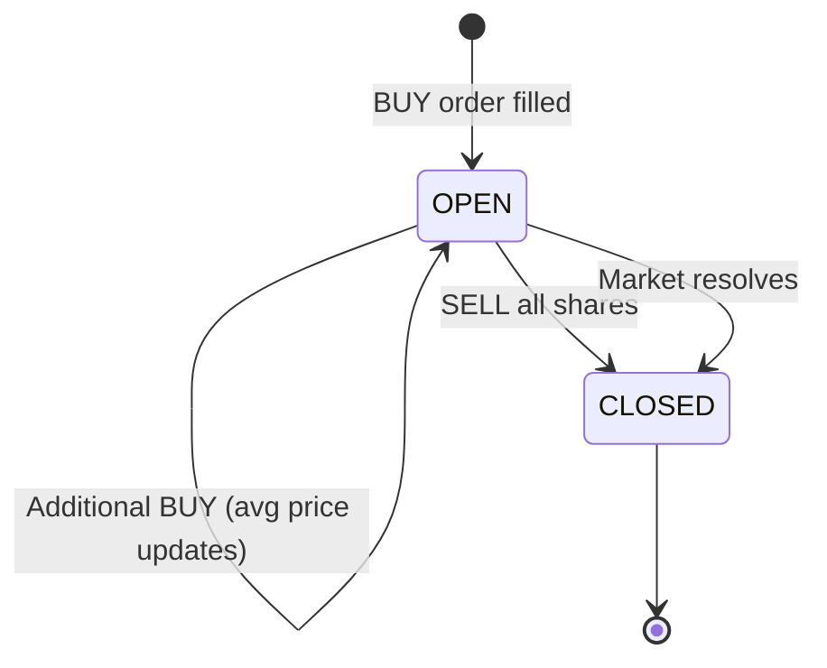

# Positions

```
GET /v1/account/positions
```

Returns your current positions with live market values and unrealized P&L.

---

## Query Parameters

| Parameter | Type | Default | Description |
|-----------|------|---------|-------------|
| `status` | string | `OPEN` | Filter: `OPEN` or `CLOSED` |
| `market_id` | string | — | Filter by condition_id |
| `limit` | int | 50 | Max results (1–500) |
| `offset` | int | 0 | Pagination offset |

---

## Request

```bash
curl -H "X-API-Key: $API_KEY" \
  "https://api.polysimulator.com/v1/account/positions?status=OPEN"
```

---

## Response

```json
[
  {
    "id": 1,
    "market_id": "0x1a2b3c...",
    "outcome": "Yes",
    "quantity": "10.0",
    "avg_entry_price": "0.65",
    "current_price": "0.70",
    "market_value": "7.00",
    "unrealized_pnl": "0.50",
    "status": "OPEN"
  }
]
```

| Field | Description |
|-------|-------------|
| `quantity` | Number of shares held |
| `avg_entry_price` | Volume-weighted average entry price |
| `current_price` | Latest market price for this outcome |
| `market_value` | `quantity × current_price` |
| `unrealized_pnl` | `market_value - (quantity × avg_entry_price)` |

---

## Position Lifecycle



---

## Next Steps

- [Portfolio](/account/portfolio) — Aggregate view with balance + positions
- [Equity Curve](/account/equity-curve) — Track value over time
