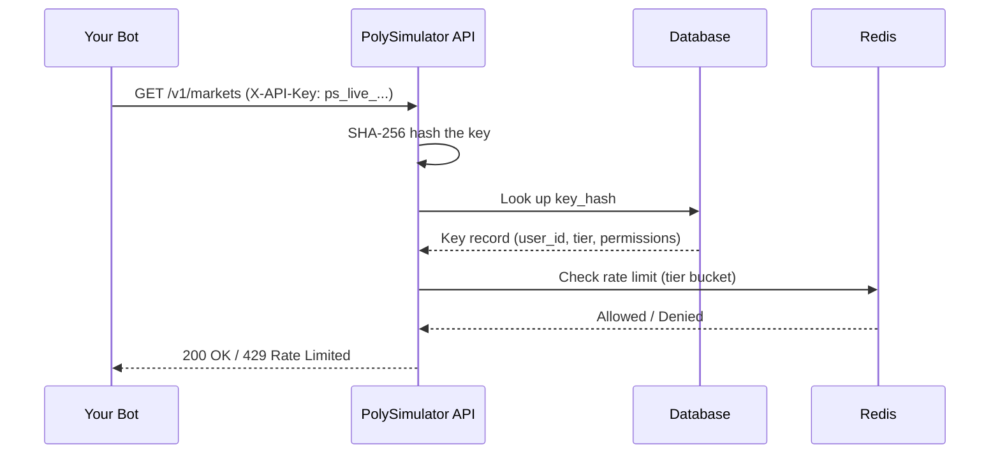

# Authentication

All API v1 endpoints require an API key passed via the `X-API-Key` HTTP header.

```bash
curl -H "X-API-Key: ps_live_abc123..." \
     https://api.polysimulator.com/v1/markets
```

---

## Key Format

Keys follow a predictable pattern for easy identification:

```
ps_live_<64 random hex chars>
```

**Example**: `ps_live_kJ9mNx2pQrStUvWxYz01Ab3CdEfGhI4j`

Each key has a **visible prefix** (first 16 chars) used for identification without exposing the full key:

| | Value |
|-|-------|
| Full key | `ps_live_kJ9mNx2pQrStUvWxYz01Ab3CdEfGhI4j` |
| Prefix | `ps_live_kJ9mNx2p` |

---

## How It Works

When you send a request:

1. Your API key is **SHA-256 hashed** and looked up in the database
2. The key's `is_active` and `expires_at` fields are validated
3. **Rate limits** are enforced based on your key's tier
4. The associated **user account** is loaded for trading operations



---

## Permissions

Keys support granular permissions:

| Permission | Grants Access To |
|------------|-----------------|
| `read` | Market data, prices, balance, positions, order history, key listing |
| `trade` | Place orders, cancel orders, create/revoke API keys |

<Warning>
  A key with only `read` permission cannot place trades. Create a key with
  `["read", "trade"]` permissions for bot usage.
</Warning>

---

## Security Best Practices

<AccordionGroup>
  <Accordion title="Store keys in environment variables">
    Never hardcode API keys in source code. Use environment variables or a secrets manager.

    ```bash
    export POLYSIM_API_KEY="ps_live_kJ9mNx2p..."
    ```

    ```python
    import os
    api_key = os.environ["POLYSIM_API_KEY"]
    ```
  </Accordion>

  <Accordion title="Use key expiration for CI/CD bots">
    Set `expires_at` when creating keys for short-lived deployments. Expired keys
    automatically stop working — no manual cleanup needed.
  </Accordion>

  <Accordion title="Principle of least privilege">
    Create separate keys for different bots:
    - **Data-only bot**: `["read"]` permission
    - **Trading bot**: `["read", "trade"]` permission
  </Accordion>

  <Accordion title="Rotate keys regularly">
    Create a new key, update your bot, then revoke the old key:

    ```bash
    # 1. Create new key
    curl -X POST -H "X-API-Key: $OLD_KEY" \
      https://api.polysimulator.com/v1/keys \
      -d '{"name": "bot-v2", "permissions": ["read", "trade"]}'

    # 2. Update your bot's environment variable

    # 3. Revoke old key
    curl -X DELETE -H "X-API-Key: $NEW_KEY" \
      https://api.polysimulator.com/v1/keys/OLD_KEY_ID
    ```
  </Accordion>

  <Accordion title="Maximum 5 keys per user">
    The system enforces a limit of 5 active keys per user account.
    Revoke unused keys to free up slots.
  </Accordion>
</AccordionGroup>

---

## Error Responses

| Status Code | Meaning |
|-------------|---------|
| `401 Unauthorized` | Invalid, expired, or deactivated API key |
| `403 Forbidden` | Key lacks required permission for the endpoint |

```json
{
  "detail": "Invalid or expired API key"
}
```

---

## Next Steps

- [Create your first API key](/concepts/api-keys)
- [Understand rate limits](/concepts/rate-limits)
- [Place your first trade](/trading/placing-orders)
