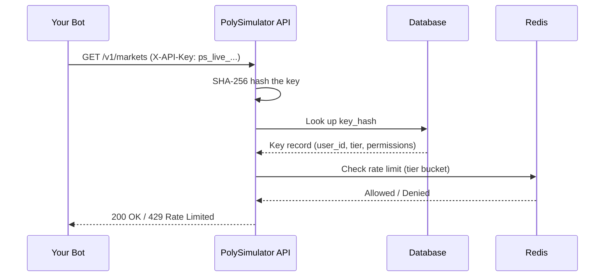

# Authentication

All PolySimulator API endpoints authenticate with the `X-API-Key` HTTP header.

<Info>
  **One auth method**: Every endpoint uses `X-API-Key`. The only exception is
  the one-time [bootstrap endpoint](/quickstart) (`POST /v1/keys/bootstrap`),
  which accepts a Supabase JWT via `Authorization: Bearer` to create your first key.
</Info>

```bash
curl -H "X-API-Key: ps_live_abc123..." \
     https://api.polysimulator.com/v1/markets
```

---

## Key Format

Keys follow a predictable pattern for easy identification:

```
ps_live_<64 random hex chars>
```

**Example**: `ps_live_kJ9mNx2pQrStUvWxYz01Ab3CdEfGhI4j`

Each key has a **visible prefix** (first 16 chars) used for identification without exposing the full key:

| | Value |
|-|-------|
| Full key | `ps_live_kJ9mNx2pQrStUvWxYz01Ab3CdEfGhI4j` |
| Prefix | `ps_live_kJ9mNx2p` |

---

## How It Works

When you send a request:

1. Your API key is **SHA-256 hashed** and looked up in the database
2. The key's `is_active` and `expires_at` fields are validated
3. **Rate limits** are enforced based on your key's tier
4. The associated **user account** is loaded for trading operations



---

## Permissions

Keys support granular permissions:

| Permission | Grants Access To |
|------------|-----------------|
| `read` | Market data, prices, balance, positions, order history, key listing |
| `trade` | Place orders, cancel orders, create/revoke API keys |

<Warning>
  A key with only `read` permission cannot place trades. Create a key with
  `["read", "trade"]` permissions for bot usage.
</Warning>

---

## Security Best Practices

<AccordionGroup>
  <Accordion title="Store keys in environment variables">
    Never hardcode API keys in source code. Use environment variables or a secrets manager.

    ```bash
    export POLYSIM_API_KEY="ps_live_kJ9mNx2p..."
    ```

    ```python
    import os
    api_key = os.environ["POLYSIM_API_KEY"]
    ```
  </Accordion>

  <Accordion title="Use key expiration for CI/CD bots">
    Set `expires_at` when creating keys for short-lived deployments. Expired keys
    automatically stop working — no manual cleanup needed.
  </Accordion>

  <Accordion title="Principle of least privilege">
    Create separate keys for different bots:
    - **Data-only bot**: `["read"]` permission
    - **Trading bot**: `["read", "trade"]` permission
  </Accordion>

  <Accordion title="Rotate keys regularly">
    Create a new key, update your bot, then revoke the old key:

    ```bash
    # 1. Create new key
    curl -X POST -H "X-API-Key: $OLD_KEY" \
      https://api.polysimulator.com/v1/keys \
      -d '{"name": "bot-v2", "permissions": ["read", "trade"]}'

    # 2. Update your bot's environment variable

    # 3. Revoke old key
    curl -X DELETE -H "X-API-Key: $NEW_KEY" \
      https://api.polysimulator.com/v1/keys/OLD_KEY_ID
    ```
  </Accordion>

  <Accordion title="Maximum 5 keys per user">
    The system enforces a limit of 5 active keys per user account.
    Revoke unused keys to free up slots.
  </Accordion>
</AccordionGroup>

---

## Error Responses

| Status Code | Meaning | Common Causes |
|-------------|---------|---------------|
| `401 Unauthorized` | Invalid, expired, or deactivated API key | Typo in key, key was revoked, key expired |
| `403 Forbidden` | Key lacks required permission for the endpoint | Using a `read`-only key to place trades |
| `429 Too Many Requests` | Rate limit exceeded | Too many requests per second/minute for your tier |

```json
// 401 — Invalid key
{"error": "HTTP_401", "message": "Invalid or expired API key", "request_id": "a1b2c3d4-..."}

// 403 — Missing permission
{"error": "HTTP_403", "message": "API key missing required permission: trade", "request_id": "a1b2c3d4-..."}

// 429 — Rate limited
{"error": "HTTP_429", "message": "Rate limit exceeded. Retry after 1s.", "request_id": "a1b2c3d4-..."}
```

<Info>
  On `429` responses, check the `Retry-After` header for exact wait time in seconds.
</Info>

---

## Bootstrap Flow (First-Time Setup)

If you have no API key yet, use the one-time bootstrap endpoint:

```python
import requests

# Step 1: Sign in at polysimulator.com to get your Supabase JWT
supabase_jwt = "your_supabase_access_token"

# Step 2: Bootstrap your first API key
resp = requests.post(
    "https://api.polysimulator.com/v1/keys/bootstrap",
    headers={
        "Authorization": f"Bearer {supabase_jwt}",
        "Content-Type": "application/json",
    },
    json={"name": "my-first-bot"},
)

if resp.status_code == 201:
    raw_key = resp.json()["raw_key"]
    print(f"Save this key NOW (shown only once): {raw_key}")
elif resp.status_code == 400:
    print("You already have keys — use POST /v1/keys with X-API-Key instead")
elif resp.status_code == 401:
    print("Invalid or expired Supabase JWT — sign in again at polysimulator.com")

# Step 3: All subsequent requests use X-API-Key
headers = {"X-API-Key": raw_key}
health = requests.get("https://api.polysimulator.com/v1/health", headers=headers)
print(health.json())  # {"status": "healthy", ...}
```

<Warning>
  The bootstrap endpoint is the **only** endpoint that *requires* `Authorization: Bearer`
  when you don't have an API key yet. Key management endpoints (`GET /v1/keys`,
  `DELETE /v1/keys/{id}`) also accept Bearer JWT as an alternative to `X-API-Key`.
  After bootstrapping, most requests use the `X-API-Key` header.
</Warning>

---

## Next Steps

- [Create your first API key](/concepts/api-keys)
- [Understand rate limits](/concepts/rate-limits)
- [Place your first trade](/trading/placing-orders)
