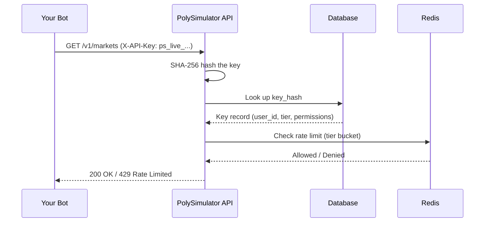

# Authentication

PolySimulator uses **two auth methods, scoped to different jobs**:

| Method | Header | Use it for |
|---|---|---|
| **API key** (primary) | `X-API-Key: ps_live_…` | Everything bots touch: trading, market data, websockets, balance/positions/history reads |
| **Supabase Bearer JWT** (dashboard / one-time) | `Authorization: Bearer …` | Self-service surfaces the dashboard reads with your signed-in session: `POST /v1/keys/bootstrap`, key management (`GET/POST/DELETE /v1/keys`, `/v1/keys/tiers`, `/v1/keys/ws-token`), `GET /v1/me`, `/v1/account/me/entitlements`, and `/v1/me/wallets/*` |

Most users only ever see the API key — the dashboard at
[polysimulator.com/api-keys](https://polysimulator.com/api-keys)
handles the Bearer-JWT bootstrap with your signed-in Supabase
session, so you click a button and copy the `ps_live_…` value.
The Bearer-JWT API path exists for headless setups (CI, dev tooling)
where there's no browser session.

The Polymarket-CLOB-compatible read endpoints (e.g. `/v1/book`,
`/v1/midpoint`, `/v1/spread`, `/v1/markets-by-token`) are **public**
and don't require a key. For convenience, PolySimulator also accepts
the single-value header aliases `POLY_API_KEY` and
`Authorization: Bearer ps_live_…`, each carrying the whole `ps_live_`
key, on authenticated routes (`X-API-Key` takes precedence when
several are sent).

```bash
# Standard
curl -H "X-API-Key: ps_live_abc123..." \
     https://api.polysimulator.com/v1/markets

# Equivalent — single-value POLY_API_KEY alias (PolySimulator convenience)
curl -H "POLY_API_KEY: ps_live_abc123..." \
     https://api.polysimulator.com/v1/markets
```

<Note>
  **These aliases are a deliberate PolySimulator simplification — not a
  literal match of Polymarket's request shape.** Real Polymarket L2 auth
  attaches **five** `POLY_*` headers per request — `POLY_ADDRESS`,
  `POLY_SIGNATURE` (an HMAC-SHA256 of the request), `POLY_TIMESTAMP`,
  `POLY_API_KEY`, `POLY_PASSPHRASE` — and `py-clob-client` /
  `@polymarket/clob-client` never send a bare `POLY_API_KEY` or an
  `Authorization: Bearer <key>` on their own. PolySimulator collapses
  all of that to one value (your `ps_live_` key) and ignores HMAC
  signing because it's a paper-trading backend. So porting a bot still
  means pointing the SDK's `host` at PolySimulator and feeding it the
  `ps_live_` key — the aliases just mean common HTTP clients that
  default to `Authorization: Bearer …` or send `POLY_API_KEY` aren't
  rejected; they don't make a real `py-clob-client` work unchanged.
</Note>

<Warning>
  **Bearer is rejected on every trading and market-data endpoint.**
  `POST /v1/orders`, `POST /v1/order`, `POST /v1/clob/order`,
  `DELETE /v1/orders/{id}`, `GET /v1/markets*`, `GET /v1/book`,
  `GET /v1/midpoint*`, the websocket connect URL, and
  `GET /v1/account/{balance,positions,portfolio,history,equity}`
  all require `X-API-Key` (or the `POLY_API_KEY` alias). This keeps
  the surface short-lived JWTs can reach narrow and auditable —
  short-lived browser tokens cannot reach the trade engine.
</Warning>

---

## Key Format

Keys follow a predictable pattern for easy identification:

```
ps_live_<64 random hex chars>
```

**Example**: `ps_live_a1b2c3d4e5f6a7b8c9d0e1f2a3b4c5d6a7b8c9d0e1f2a3b4c5d6a7b8c9d0e1f2`

Each key has a **visible prefix** (first 16 chars) used for identification without exposing the full key:

| | Value |
|-|-------|
| Full key | `ps_live_a1b2c3d4e5f6a7b8c9d0e1f2a3b4c5d6a7b8c9d0e1f2a3b4c5d6a7b8c9d0e1f2` |
| Prefix | `ps_live_a1b2c3d4` |

---

## How It Works

When you send a request:

1. Your API key is **SHA-256 hashed** and looked up in the database
2. The key's `is_active` and `expires_at` fields are validated
3. **Rate limits** are enforced based on your key's tier
4. The associated **user account** is loaded for trading operations


```mermaid
sequenceDiagram
    participant Bot as Your Bot
    participant API as PolySimulator API
    participant DB as Database
    participant Redis as Redis

    Bot->>API: GET /v1/markets (X-API-Key: ps_live_...)
    API->>API: SHA-256 hash the key
    API->>DB: Look up key_hash
    DB-->>API: Key record (user_id, tier, permissions)
    API->>Redis: Check rate limit (tier bucket)
    Redis-->>API: Allowed / Denied
    API-->>Bot: 200 OK / 429 Rate Limited
```

---

## Permissions

Keys support granular permissions:

| Permission | Grants Access To |
|------------|-----------------|
| `read` | Market data, prices, balance, positions, order history |
| `trade` | Place orders, cancel orders, cancel-all, batch orders |

<Warning>
  A key with only `read` permission cannot place trades. Create a key with
  `["read", "trade"]` permissions for bot usage.
</Warning>

<Note>
  **Key management is gated by auth, not by the `trade` scope.**
  Creating, listing, renaming, rotating, and revoking keys
  (`POST`/`GET`/`PATCH`/`DELETE /v1/keys`, `/v1/keys/{id}/rotate`) only
  require a valid credential for your account — any active `ps_live_` key
  (even a read-only one) or your dashboard Supabase JWT. You don't need a
  `trade`-scoped key to manage keys. (Free-tier keys are still read-only
  for trading and can't be created *with* `trade` — that's enforced at
  creation, see below.)
</Note>

---

## Security Best Practices

<AccordionGroup>
  <Accordion title="Store keys in environment variables">
    Never hardcode API keys in source code. Use environment variables or a secrets manager.

    ```bash
    export POLYSIM_API_KEY="ps_live_kJ9mNx2p..."
    ```

    ```python
    import os
    api_key = os.environ["POLYSIM_API_KEY"]
    ```
  </Accordion>

  <Accordion title="Rotate keys for short-lived CI/CD deployments">
    There is **no `expires_at` field on key creation** — `POST /v1/keys`
    and `POST /v1/keys/bootstrap` only accept `name`, `tier`, and
    `permissions`. (`expires_at` is set server-side: it appears on a
    *rotated* key's old half during the 24h overlap window, and on
    beta-issued keys as their `beta_until` cutoff.) For short-lived
    deployments, **rotate** instead: `POST /v1/keys/{id}/rotate` mints a
    replacement and schedules the old key to expire after a 24h overlap,
    so you can roll a key without downtime and let the old one lapse on
    its own.
  </Accordion>

  <Accordion title="Principle of least privilege">
    Create separate keys for different bots:
    - **Data-only bot**: `["read"]` permission
    - **Trading bot**: `["read", "trade"]` permission
  </Accordion>

  <Accordion title="Rotate keys regularly">
    Create a new key, update your bot, then revoke the old key:

    ```bash
    # 1. Create new key
    curl -X POST -H "X-API-Key: $OLD_KEY" \
      https://api.polysimulator.com/v1/keys \
      -d '{"name": "bot-v2", "permissions": ["read", "trade"]}'

    # 2. Update your bot's environment variable

    # 3. Revoke old key
    curl -X DELETE -H "X-API-Key: $NEW_KEY" \
      https://api.polysimulator.com/v1/keys/OLD_KEY_ID
    ```
  </Accordion>

  <Accordion title="Maximum 5 keys per user">
    The system enforces a limit of 5 active keys per user account.
    Revoke unused keys to free up slots.
  </Accordion>
</AccordionGroup>

---

## Error Responses

| Status Code | Meaning | Common Causes |
|-------------|---------|---------------|
| `401 Unauthorized` | Invalid, expired, or deactivated API key | Typo in key, key was revoked, key expired |
| `403 Forbidden` | Key lacks required permission for the endpoint | Using a `read`-only key to place trades |
| `429 Too Many Requests` | Rate limit exceeded | Too many requests per second/minute for your tier |

All `/v1/*` errors return Polymarket-shape: a single `error` field
holding a human-readable description when one is available. (For
unhandled exception paths where no message was set, the body falls
back to the short machine code — so always branch on the
`X-Polysim-Code` response header for stable error handling, not on
the body text.)

The `X-Polysim-Code` response header carries a stable short code —
domain-specific where the handler knows what went wrong (e.g.
`INVALID_KEY`, `INSUFFICIENT_PERMISSION`, `RATE_LIMIT_EXCEEDED`,
`BOOK_UNAVAILABLE`, `VALIDATION_FAILED`), or `HTTP_<status>` as a
generic fallback (`HTTP_400`, `HTTP_500`).

The `X-Request-Id` response header always echoes the request id for
log/support correlation.

```json
// 401 — Invalid API key (handler sets X-Polysim-Code: INVALID_KEY)
{"error": "Invalid API key"}
// + headers: X-Polysim-Code: INVALID_KEY, X-Request-Id: a1b2c3d4-...

// 403 — Missing permission
{"error": "API key missing required permission: trade"}
// + headers: X-Polysim-Code: INSUFFICIENT_PERMISSION, X-Request-Id: ...

// 429 — Rate limited
{"error": "Rate limit exceeded. Retry after 1s."}
// + headers: X-Polysim-Code: RATE_LIMIT_EXCEEDED, X-Request-Id: ..., Retry-After: 1
```

Common auth/permission codes — branch on `X-Polysim-Code`:

| Code | HTTP | When |
| --- | --- | --- |
| `MISSING_AUTH` | 401 | No `Authorization: Bearer …` or `X-API-Key` (or `POLY_API_KEY`) on a route that requires one |
| `MISSING_API_KEY` | 401 | `X-API-Key` / `POLY_API_KEY` is missing on a key-only route (e.g. trading, market data, account reads) |
| `INVALID_KEY` | 401 | Key doesn't exist or is revoked |
| `INVALID_TOKEN` | 401 | Bearer JWT is malformed, missing `sub`, or fails signature verification |
| `KEY_EXPIRED` | 401 | Key past its `expires_at` |
| `KEY_DEACTIVATED` | 401 | Key was administratively disabled |
| `KEY_OWNER_NOT_FOUND` | 401 | Underlying user record missing (rare) |
| `TOKEN_EXPIRED` | 401 | Bearer JWT expired |
| `ACCESS_RESTRICTED` | 403 | An **already-issued** key (or a Bearer JWT) is not on the API v1 allowlist. Returned on authenticated `/v1/*` requests for accounts outside the admin-managed allowlist, and for accounts flagged or under review. |
| `CLOSED_BETA` | 403 | Key **issuance** is gated: `POST /v1/keys` / `POST /v1/keys/bootstrap` refuse callers who are not in an admitted [closed-beta](#closed-beta) cohort. The default outcome while the beta is closed. Apply via the waitlist. |
| `API_PRO_COMING_SOON` | 403 | Key **issuance** for a paying **Pro / Pro+** account that doesn't yet have a cohort grant — a billing-aware "rolling it out in cohorts" variant of the issuance gate. Only reached once self-serve issuance is enabled; until then a paying caller also sees `CLOSED_BETA`. |
| `INSUFFICIENT_PERMISSION` | 403 | Key lacks `trade` / other scope |
| `RATE_LIMIT_EXCEEDED` | 429 | Per-key or per-IP burst exceeded |

<Info>
  On `429` responses, check the `Retry-After` header for exact wait time in seconds.
</Info>

<Tip>
  **Verbose body opt-in.** Send `X-Polysim-Verbose: true` on the request
  to get the legacy verbose body shape — useful while writing or
  debugging an SDK:
  ```json
  {"error": "INVALID_KEY", "message": "Invalid API key",
   "details": null, "request_id": "a1b2c3d4-..."}
  ```
  The default single-field shape matches Polymarket's own /clob error
  contract, so PM-shape SDK ports work without translation.
</Tip>

---

## Bootstrap Flow (First-Time Setup)

The recommended path is the dashboard at
[polysimulator.com/api-keys](https://polysimulator.com/api-keys).
Sign in, click **Create your first API key**, and copy the
`ps_live_…` value shown once. The dashboard handles the Supabase
JWT exchange transparently.

### Bootstrap from a script (headless / CI)

If you can't open a browser and you have a Supabase access token in
hand, call `POST /v1/keys/bootstrap` directly:

```python
import requests

# Obtain via a programmatic Supabase sign-in — most users don't
# need this path; the dashboard does it for you.
supabase_jwt = "your_supabase_access_token"

resp = requests.post(
    "https://api.polysimulator.com/v1/keys/bootstrap",
    headers={
        "Authorization": f"Bearer {supabase_jwt}",
        "Content-Type": "application/json",
    },
    json={"name": "my-first-bot"},
)

if resp.status_code == 201:
    raw_key = resp.json()["raw_key"]
    print(f"Save this key NOW (shown only once): {raw_key}")
elif resp.status_code == 400:
    print("You already have keys — use POST /v1/keys with X-API-Key instead")
elif resp.status_code == 401:
    print("Invalid or expired Supabase JWT — sign in again at polysimulator.com")
elif resp.status_code == 403:
    # Branch on the stable machine code in the `X-Polysim-Code` header.
    # The response body is PM-shape `{"error": "<human msg>"}`, so the
    # body's `error` field is the human message — NOT a stable code.
    # Header lookup is case-insensitive in `requests` / most HTTP libs.
    code = resp.headers.get("X-Polysim-Code")
    if code == "CLOSED_BETA":
        # API key issuance is in closed beta — your account isn't in an
        # admitted cohort yet. Apply via the waitlist at
        # https://polysimulator.com/api-trading; we'll email you when a cohort opens.
        print("Closed beta — apply at https://polysimulator.com/api-trading")
    elif code == "API_PRO_COMING_SOON":
        # Your Pro / Pro+ subscription includes API access — it's being
        # rolled out in cohorts. Check your billing page.
        print("Pro API access is rolling out — see /account/billing")
    elif code == "ACCESS_RESTRICTED":
        # The account is not on the API v1 allowlist (flagged / under review).
        print("Access restricted — contact support")
    else:
        print(f"403 [{code}]: {resp.json().get('error')}")
elif resp.status_code == 429:
    print("Bootstrap rate limit hit — wait and retry")

headers = {"X-API-Key": raw_key}
health = requests.get("https://api.polysimulator.com/v1/health", headers=headers)
print(health.json())  # {"status": "ok", "timestamp": "...", "version": "1.0.0"}
```

### Security boundary

- JWTs are verified using HS256 against the project's Supabase
  signing secret, with `audience="authenticated"`, signature,
  expiry, and the `sub` UUID all enforced server-side. Anon and
  service-role tokens are rejected.
- Bearer is accepted on the **dashboard surface only**:
  `POST /v1/keys/bootstrap`, key management
  (`GET/POST/DELETE /v1/keys`, `/v1/keys/tiers`, `/v1/keys/ws-token`),
  `GET /v1/me`, `GET /v1/account/me/entitlements`, and
  `/v1/me/wallets/*` — the routes the signed-in dashboard reads.
  Trading (`/v1/orders`, `/v1/order`, `/v1/clob/order`), market data
  (`/v1/markets*`, `/v1/book`, `/v1/midpoint*`, etc.), the
  account-trading reads (`/v1/account/{balance,positions,portfolio,
  history,equity}`), and the websocket connect URL all require
  `X-API-Key` and reject Bearer with 401 — short-lived JWTs cannot
  reach the trade engine or the account ledger.
- Bootstrap is idempotency-bounded: if the JWT subject already has
  any key, the endpoint returns 400 `BOOTSTRAP_NOT_ALLOWED` and the
  caller must use `POST /v1/keys` (with `X-API-Key`) for additional
  keys.
- Bootstrap is rate-limited at 5 calls/hour and 1 call/minute per
  IP, on top of the global IP rate limit. Real users only bootstrap
  once per account; the limit caps abuse without breaking legitimate
  network-error retries.

---

## Closed Beta

The API is in an **ongoing closed beta**: new API keys are issued to
approved cohorts only. There are two distinct gates, with distinct
error codes — branch on the `X-Polysim-Code` response header:

### 1. Key issuance — `CLOSED_BETA` / `API_PRO_COMING_SOON`

`POST /v1/keys/bootstrap` (first key) and `POST /v1/keys` (additional
keys) refuse callers who aren't in an admitted cohort. While the beta
is closed (the default), **every** non-admin, non-cohort caller —
free, waitlisted, **or** paying — gets **`403 CLOSED_BETA`**: apply via
the waitlist and we'll email you when a cohort opens.

`API_PRO_COMING_SOON` is a **conditional** variant of the same gate.
Once self-serve issuance is enabled, the gate routes by subscription
tier: free callers self-serve a read-only key, while a paying
**Pro / Pro+** caller without a cohort grant gets the billing-aware
**`403 API_PRO_COMING_SOON`** ("your subscription includes API access;
it's being rolled out in cohorts") instead. Until that flag flips,
paying callers also see `CLOSED_BETA`.

Both are PM-shape envelopes. The default body is the single-field
`{"error": "<human message>"}` form; the stable machine code lives in
the `X-Polysim-Code` response header. (The `feature_key` /
`upgrade_url` routing hints from the underlying error are carried in
the body **only on `402` upgrade responses**, not on these `403`s —
read them from the verbose body if you need them, via
`X-Polysim-Verbose: true`.)

```http
HTTP/1.1 403 Forbidden
X-Polysim-Code: CLOSED_BETA
X-Request-Id: a1b2c3d4-...
Content-Type: application/json
```

```json
{"error": "API access is in closed beta. New keys are issued to approved cohorts only. Apply via the waitlist; we'll email you when a cohort opens."}
```

```python
resp = requests.post(
    "https://api.polysimulator.com/v1/keys/bootstrap",
    headers={"Authorization": f"Bearer {supabase_jwt}"},
    json={"name": "first-key"},
)
if resp.status_code == 403:
    code = resp.headers.get("X-Polysim-Code")
    if code == "CLOSED_BETA":
        # Not in an admitted cohort yet. Apply via the waitlist; we'll
        # email you when a cohort opens.
        print("Closed beta — apply at https://polysimulator.com/api-trading")
    elif code == "API_PRO_COMING_SOON":
        # Your Pro / Pro+ subscription includes API access — being
        # rolled out in cohorts. Check /account/billing.
        print("Pro API access is rolling out — see /account/billing")
```

### 2. Runtime access — `ACCESS_RESTRICTED`

Once a key is issued, authenticated `/v1/*` requests are additionally
gated by an admin-managed allowlist. An account that isn't on the
allowlist (or is flagged / under review) gets **`403 ACCESS_RESTRICTED`**
on every authenticated request. Like every `/v1/*` error, the stable
machine code is in the `X-Polysim-Code` response header:

```http
HTTP/1.1 403 Forbidden
X-Polysim-Code: ACCESS_RESTRICTED
X-Request-Id: a1b2c3d4-...
Content-Type: application/json
```

```json
{"error": "API access restricted. Contact support to request access."}
```

The cohort is managed by adding the user's email to the
`api_allowlist` table (admin tooling: `POST /admin/api-keys/issue-beta`
also pre-creates an enterprise-tier key with a fixed cutoff).
Allowlist additions take effect on the next request — there's no
client-visible toggle the gate is bound to.

Apply via the waitlist at
[polysimulator.com/api-trading](https://polysimulator.com/api-trading).

### Beta-issued keys auto-downgrade after the cutoff

Beta-issued keys carry a fixed `beta_until` cutoff. After the
cutoff, the key is auto-downgraded to free-tier limits and
read-only permissions on every request. Every response on a
downgraded key includes `X-API-Beta-Cutoff: expired` so SDKs can
pivot to read-only mode without a separate round-trip:

```python
resp = client.get_orders()
if resp.headers.get("x-api-beta-cutoff") == "expired":
    print("Beta cohort ended — convert to a paid Pro key for trade access")
```

The public cohort-status endpoint reports current capacity (no auth
required, used by the pricing page):

```bash
curl https://api.polysimulator.com/api/beta/cohort-status
# → {"cohort_label": "beta-2026-05", "available": true, "active": 12,
#    "cap": 100, "cutoff": "2026-08-31T23:59:59Z", "reopens_at": null}
# `cutoff` is operator-configurable via the BETA_COHORT_CUTOFF env var.
```

---

## Next Steps

- [Create your first API key](/concepts/api-keys)
- [Understand rate limits](/concepts/rate-limits)
- [Place your first trade](/trading/placing-orders)
