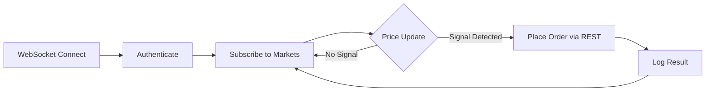

# WebSocket Trading Bot

Build a real-time bot that reacts to price changes **instantly** via WebSocket streaming, instead of polling the REST API.

---

## Architecture



---

## Full Source Code

<CodeGroup>

```python Python (asyncio)
#!/usr/bin/env python3
"""
WebSocket Trading Bot for PolySimulator

Streams real-time prices via WebSocket and places orders via REST
when price signals are detected.

Usage:
    export POLYSIM_API_KEY="ps_live_..."
    python ws_bot.py
"""

import asyncio
import json
import os
import time

import aiohttp


API_KEY = os.environ["POLYSIM_API_KEY"]
BASE_URL = os.environ.get("POLYSIM_BASE_URL", "http://localhost:8000")
WS_URL = BASE_URL.replace("http://", "ws://").replace("https://", "wss://")


async def get_ws_token(session):
    """Obtain a short-lived WebSocket authentication token."""
    async with session.post(
        f"{BASE_URL}/v1/keys/ws-token",
        headers={"X-API-Key": API_KEY},
    ) as resp:
        data = await resp.json()
        return data["token"]


async def place_order(session, market_id, side, outcome, quantity):
    """Place an order via REST API."""
    payload = {
        "market_id": market_id,
        "side": side,
        "outcome": outcome,
        "quantity": str(quantity),
        "order_type": "market",
    }
    async with session.post(
        f"{BASE_URL}/v1/orders",
        headers={
            "X-API-Key": API_KEY,
            "Content-Type": "application/json",
            "Idempotency-Key": f"ws-{market_id}-{side}-{int(time.time())}",
        },
        json=payload,
    ) as resp:
        return await resp.json()


async def run_ws_bot(market_ids: list[str]):
    """Main WebSocket bot loop."""
    async with aiohttp.ClientSession() as session:
        # 1. Get WebSocket token
        token = await get_ws_token(session)
        print(f"Got WS token, connecting...")

        # 2. Connect to WebSocket
        async with session.ws_connect(
            f"{WS_URL}/v1/ws/prices?token={token}"
        ) as ws:
            # 3. Subscribe to markets
            await ws.send_json({
                "action": "subscribe",
                "markets": market_ids,
            })
            print(f"Subscribed to {len(market_ids)} markets")

            # 4. Process price updates
            async for msg in ws:
                if msg.type == aiohttp.WSMsgType.TEXT:
                    data = json.loads(msg.data)

                    if data.get("type") == "price":
                        market_id = data["market_id"]
                        yes_price = float(data["buy"])

                        # Strategy: buy when Yes < 0.35, sell when > 0.65
                        if yes_price < 0.35:
                            print(f"BUY signal: {market_id} @ {yes_price:.2f}")
                            result = await place_order(
                                session, market_id, "BUY", "Yes", 5
                            )
                            print(f"  → {result.get('status')} @ {result.get('price')}")

                        elif yes_price > 0.65:
                            print(f"SELL signal: {market_id} @ {yes_price:.2f}")
                            result = await place_order(
                                session, market_id, "SELL", "Yes", 5
                            )
                            print(f"  → {result.get('status')} @ {result.get('price')}")

                    elif data.get("type") == "pong":
                        pass  # Heartbeat response

                elif msg.type == aiohttp.WSMsgType.CLOSED:
                    print("WebSocket closed, reconnecting...")
                    break
                elif msg.type == aiohttp.WSMsgType.ERROR:
                    print(f"WebSocket error: {ws.exception()}")
                    break


async def main():
    # Define which markets to monitor
    market_ids = [
        "0x1234abcd...",  # Replace with actual condition IDs
        "0x5678efgh...",
    ]

    while True:
        try:
            await run_ws_bot(market_ids)
        except Exception as e:
            print(f"Connection error: {e}")
        print("Reconnecting in 5s...")
        await asyncio.sleep(5)


if __name__ == "__main__":
    asyncio.run(main())
```

```javascript JavaScript (Node.js)
const WebSocket = require("ws");
const fetch = require("node-fetch");

const API_KEY = process.env.POLYSIM_API_KEY;
const BASE_URL = process.env.POLYSIM_BASE_URL || "http://localhost:8000";
const WS_URL = BASE_URL.replace("http://", "ws://").replace("https://", "wss://");

async function getWsToken() {
  const resp = await fetch(`${BASE_URL}/v1/keys/ws-token`, {
    method: "POST",
    headers: { "X-API-Key": API_KEY },
  });
  const data = await resp.json();
  return data.token;
}

async function placeOrder(marketId, side, outcome, quantity) {
  const resp = await fetch(`${BASE_URL}/v1/orders`, {
    method: "POST",
    headers: {
      "X-API-Key": API_KEY,
      "Content-Type": "application/json",
      "Idempotency-Key": `ws-${marketId}-${side}-${Date.now()}`,
    },
    body: JSON.stringify({
      market_id: marketId,
      side,
      outcome,
      quantity: String(quantity),
      order_type: "market",
    }),
  });
  return resp.json();
}

async function runBot(marketIds) {
  const token = await getWsToken();
  const ws = new WebSocket(`${WS_URL}/v1/ws/prices?token=${token}`);

  ws.on("open", () => {
    ws.send(JSON.stringify({
      action: "subscribe",
      markets: marketIds,
    }));
    console.log(`Subscribed to ${marketIds.length} markets`);
  });

  ws.on("message", async (raw) => {
    const data = JSON.parse(raw);
    if (data.type === "price") {
      const yesPrice = parseFloat(data.buy);
      if (yesPrice < 0.35) {
        console.log(`BUY signal: ${data.market_id} @ ${yesPrice}`);
        const result = await placeOrder(data.market_id, "BUY", "Yes", 5);
        console.log(`  → ${result.status} @ ${result.price}`);
      } else if (yesPrice > 0.65) {
        console.log(`SELL signal: ${data.market_id} @ ${yesPrice}`);
        const result = await placeOrder(data.market_id, "SELL", "Yes", 5);
        console.log(`  → ${result.status} @ ${result.price}`);
      }
    }
  });

  ws.on("close", () => console.log("WebSocket closed"));
  ws.on("error", (err) => console.error("WebSocket error:", err));
}

runBot(["0x1234abcd...", "0x5678efgh..."]);
```

</CodeGroup>

---

## Why WebSocket Over Polling?

| Metric | REST Polling (5s) | WebSocket |
|--------|-------------------|-----------|
| Latency | 0–5,000 ms | \<100 ms |
| API calls/hour | 720 per market | 1 (connection) |
| Rate limit risk | High | None |
| Data freshness | Stale up to 5s | Real-time |

<Tip>
  Use REST API for **order placement** and **account queries**.
  Use WebSocket for **price monitoring** and **signal detection**.
</Tip>

---

## Connection Management

<Warning>
  WebSocket tokens expire after **60 seconds**. Your bot must handle reconnection:
  1. Detect close/error events
  2. Request a new token via `POST /v1/keys/ws-token`
  3. Re-subscribe to all markets
</Warning>

---

## Next Steps

- [Error Handling](/bots/error-handling) — Robust error and retry patterns
- [Best Practices](/bots/best-practices) — Production bot patterns
