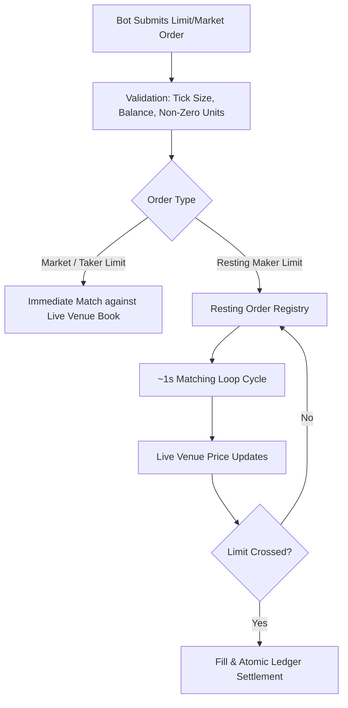

# Simulation Realism & Honest Limits

PolySimulator is designed to provide **venue-compatible paper trading for bot development**: develop and validate a Polymarket trading bot against a compatible API (CLOB-compatible routes + drop-in SDK integration), with real-time prices and real accounting, without risking capital — then switch endpoints to go live.

This page documents exactly what PolySimulator **does** and **does not** simulate. Transparent execution boundaries build reliable trading systems.

---

## The Execution Model

### 1. ~1-Second Matching Loop

* **Resting limit orders** are evaluated by a background matching loop running approximately every **1 second**.
* When the live venue price crosses your limit price, your resting order is filled on the next loop cycle.
* **Latency implication:** High-frequency, sub-second latency arbitrage strategies will observe optimistic fills compared to live venue execution, because paper resting orders do not contend with exchange gateway transit latency or colocation queues.

### 2. Live-Price Fill Source

* Every fill executes against **live Polymarket venue prices** sampled in real time from the Polymarket CLOB WebSocket and REST feeds.
* Fills evaluate prices through a priority cascade:
  1. **Order Book Walk (VWAP):** Size-aware execution walking the merged primary and complementary order books.
  2. **Top of Book (Best Bid/Ask):** Best available touch price with complement-aware merging.
  3. **CLOB Midpoint Cache:** Sub-millisecond cached midpoint `(best_bid + best_ask) / 2`.
  4. **Cached Display Price:** Sanity-checked outcome price.

---

## What Is and Is Not Simulated

| Dimension | Paper Trading (PolySimulator) | Live Polymarket Venue | Notes |
| :--- | :--- | :--- | :--- |
| **API Wire Compatibility** | ✅ Identical | Native Polymarket | 1:1 CLOB-compat routes, order shapes, and data endpoints. |
| **Price Feeds** | ✅ Live Real-Time | Live Real-Time | Real CLOB book depth, Binance spot, and Chainlink oracle feeds. |
| **Fee Schedule** | ✅ Exact V2 Schedule | Exact V2 Schedule | Per-category taker fees (crypto 7%, economics/culture/weather/other 5%, finance/politics/mentions/tech 4%, sports 3%, geopolitics 0%, unknown/missing category **5% fallback**). See [Trading Fees](/trading/fees). |
| **Balance & Portfolio Accounting** | ✅ Exact & Atomic | On-Chain / Vault | String-decimal arithmetic, wallet isolation, PnL tracking. |
| **Tick Size & Precision** | ✅ Strict Grid Enforcement | Strict Grid Enforcement | 0.1, 0.01, 0.001, 0.0001 tick sizes strictly validated. |
| **Queue Position (FIFO)** | ❌ Not Simulated | Live FIFO Queue | Fills trigger on price crossing regardless of volume ahead in queue. |
| **Self / Market Impact** | ❌ No Impact | Market Impact | Large paper orders do not move the real-world venue order book. |
| **On-Chain Settlement** | ❌ Simulated Ledger | Polygon PoS | Paper trading requires no gas, private keys, or wallet transactions. |

### Numeric exceptions (honest, not hidden)

| Claim | Exact number | Exception |
| --- | --- | --- |
| Matching loop | ~**1 second** | Loop cadence is best-effort. A busy replica can skip a cycle; do not treat 1.000 s as a hard SLA. |
| Free REST | **2 req/s**, **120 req/min** | Burst can use the 2 req/s bucket first; sustained load hits the 120/min bucket. Authoritative: `GET /v1/keys/tiers`. |
| Pro REST | **10 req/s**, **600 req/min** | Same two-bucket model. |
| Pro+ REST | **30 req/s**, **1,800 req/min** | Same two-bucket model. |
| Enterprise REST | **100 req/s**, **6,000 req/min** | Same two-bucket model. |
| Fee formula | 5 decimal places | Amount **debited** is settled at **cent** precision (`Numeric(18,2)`). Sub-cent fees round to `$0.00`. |
| Unknown category fee | **5% / 500 bps** | Applied when the market has no category. Not geopolitics (0%). |
| API wallet | Pro **$10,000**, Pro+ **$25,000** | Free keys have **no** API wallet and cannot trade. MAIN ($1,000) is never used by API keys. |
| Tick sizes | `0.1` / `0.01` / `0.001` / `0.0001` | Market-aware. Off-grid limits return `INVALID_ORDER_MIN_TICK_SIZE`. |
| String numerics | JSON **strings** for prices, sizes, balances | Polymarket-parity exceptions: `GET /v1/tick-size/{token_id}` `minimum_tick_size` and `GET /v1/markets/updown` `live_price.buy/sell` are JSON **numbers**. See [String Numerics](/concepts/string-numerics). |

---

## Simulation Boundaries in Detail

### No Queue-Position Modelling
In a live matching engine, when you place a limit order at the current bid, your order joins the back of the queue at that price level and only fills after all orders placed before yours have been matched or canceled. 

In PolySimulator paper trading, resting orders match whenever the venue price crosses your limit. If you place a limit BUY at $0.50 and the venue trades at $0.50, your order fills on the next loop iteration without simulating queue depletion ahead of you. 

<Tip>
  For realistic backtesting that models queue dynamics and historical book reconstruction, use the upcoming **Simulation SKU** rather than paper trading.
</Tip>

### No Self-Impact
In live markets, large orders consume liquidity and shift the market price against the trader. In PolySimulator, your trades update your virtual portfolio and ledger, but do not affect external Polymarket order books. Size-aware VWAP book walking simulates the price you *would* receive given current book depth, but does not move the market for subsequent orders.

---

## What PolySimulator Guarantees

<CardGroup cols={2}>
  <Card title="Decimal-Safe String Numerics" icon="calculator">
    Price, quantity, and balance values are transmitted as JSON strings (e.g. `"0.52"`) except the documented Polymarket-parity exceptions in [String Numerics](/concepts/string-numerics) (`GET /v1/tick-size/{token_id}` `minimum_tick_size` and `/v1/markets/updown` `live_price.buy/sell`). The backend still enforces exact decimal math without binary float rounding errors.
  </Card>

  <Card title="Multi-Wallet Isolation" icon="shield-halved">
    API keys trade exclusively against an isolated **API Sandbox Wallet** ($10,000 baseline for Pro, $25,000 for Pro+). The primary UI wallet (`MAIN`) is never modified by API trading.
  </Card>

  <Card title="Deterministic Idempotency" icon="arrows-rotate">
    Duplicate submissions carrying the same `client_order_id` (or `Idempotency-Key` header) return the existing order without double-executing.
  </Card>

  <Card title="Lifelike Error Taxonomy" icon="triangle-exclamation">
    Order validation rejects off-grid ticks (`INVALID_ORDER_MIN_TICK_SIZE`), below-minimum sizes (`INVALID_ORDER_MIN_SIZE`), and insufficient balance with identical Polymarket-style error envelopes.
  </Card>
</CardGroup>

---

## Operational Boundaries & Beta SLA

* **Beta Availability:** PolySimulator API Beta is a development and validation environment. While we aim for high uptime (>99.9%), the beta surface does not carry a formal financial SLA.
* **Rate Limits:** Per-key rate limits are enforced with **fixed windows** — a
  per-second bucket and a per-minute bucket, each keyed on the current clock
  second/minute (e.g. Free: 2 RPS / 120 RPM, Pro: 10 RPS / 600 RPM).

  <Warning>
  A fixed window has a **boundary burst**: because the counter resets at each
  clock second, a client aligned to that boundary can send its full per-second
  allowance just before the tick and again just after — briefly about **twice**
  the nominal RPS. We do not treat that as abuse, but do not design around it
  either: it is a property of the window, not a documented allowance, and
  tightening it later would break a client that relied on it.
  </Warning>

  <Warning>
  **The limiter fails open.** If Redis is unreachable the limit check returns
  full headroom rather than rejecting your request, so during a cache outage
  the stated limits are not enforced. This is a deliberate availability trade —
  we would rather serve you unthrottled than fail your requests because *our*
  cache is down — and it is stated here so the guarantee you are buying is the
  guarantee you actually get.
  </Warning>
* **Deprecation Policy:** Breaking API or schema changes during public beta will be communicated with at least **14 days notice** via email and documentation changelogs.
