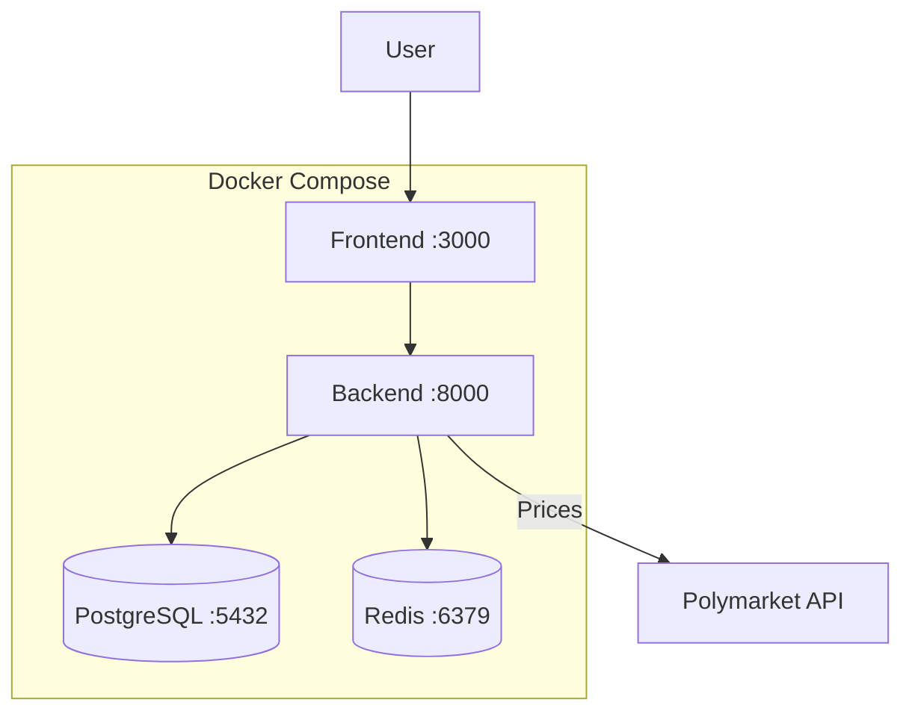

# Docker Deployment

PolySimulator provides Docker images for production deployment with full orchestration via Docker Compose.

---

## Quick Start

```bash
# Clone and configure
git clone https://github.com/Bavariance/polysimulator.git
cd polysimulator
cp backend/.env.example backend/.env
# Edit backend/.env with your credentials

# Build and start all services
docker compose -f docker-compose.prod.yml up -d --build
```

---

## Architecture



---

## Docker Compose Configuration

The production compose file starts four services:

| Service | Image | Port | Purpose |
|---------|-------|------|---------|
| `backend` | Custom | 8000 | FastAPI API server |
| `frontend` | Custom | 3000 | Next.js web UI |
| `db` | postgres:16 | 5432 | PostgreSQL database |
| `redis` | redis:7-alpine | 6379 | Price cache |

<Info>
  If you use **Supabase** for your database, you can omit the `db` service and point `DATABASE_URL` at your Supabase project.
</Info>

---

## Building Images

```bash
# Backend
docker build -t polysimulator-backend ./backend

# Frontend
docker build -f frontend/Dockerfile.prod -t polysimulator-frontend ./frontend
```

---

## Container Startup

The backend container runs `docker-entrypoint.sh` which:

1. Waits for PostgreSQL to be ready
2. Runs Alembic migrations (`alembic upgrade head`)
3. Starts uvicorn with production settings

```bash
# View startup logs
docker compose logs -f backend
```

---

## Health Checks

Docker Compose includes health checks for all services:

```bash
# Check all service health
docker compose ps

# Backend health
curl http://localhost:8000/v1/health/ready

# Redis connectivity
docker compose exec redis redis-cli ping
```

---

## Scaling

For higher throughput, run multiple backend workers:

```bash
# Scale to 4 backend workers
docker compose -f docker-compose.prod.yml up -d --scale backend=4
```

<Warning>
  When scaling, ensure a reverse proxy (nginx, Traefik) distributes traffic across backend instances. WebSocket connections require sticky sessions.
</Warning>

---

## Updating

```bash
# Pull latest code
git pull origin main

# Rebuild and restart
docker compose -f docker-compose.prod.yml up -d --build

# Migrations run automatically on startup
```

---

## Next Steps

- [Monitoring](/deployment/monitoring) — Prometheus metrics and health endpoints
- [Live Migration](/deployment/live-migration) — Switch from virtual to live trading
