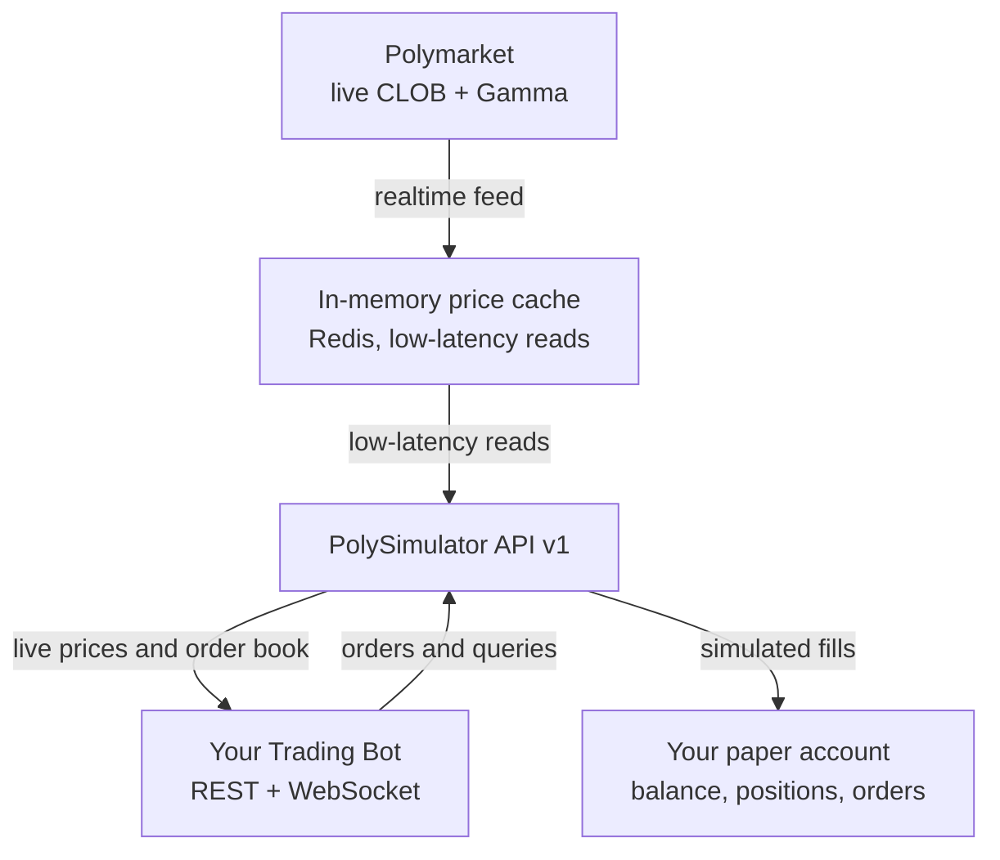

# PolySimulator HFT API v1

Build, test, and deploy prediction market trading bots in a risk-free environment
powered by **real-time Polymarket data**. When you're ready, switch to live trading
by changing a single environment variable.

<Frame caption="pip install → a 5-line script → a filled trade. Start in the Quickstart.">
  
</Frame>

<CardGroup cols={2}>
  <Card title="Quick Start" icon="rocket" href="/quickstart">
    Get your API key and place your first trade in under 2 minutes.
  </Card>
  <Card title="Python SDK" icon="python" href="/sdk">
    `pip install polysimulator` — the official `PolySimClient`. Porting a `py-clob-client` or py-sdk bot? Drop-ins included.
  </Card>
  <Card title="API Reference" icon="square-terminal" href="/api-reference">
    Interactive playground — test every endpoint with your API key.
  </Card>
  <Card title="Example Bot" icon="robot" href="/bots/example-trading-bot">
    Copy-paste a working Python trading bot and start experimenting.
  </Card>
</CardGroup>

---

## Why PolySimulator?

| Feature | Description |
|---------|-------------|
| **Real Data** | Live mid-prices, bids, asks from Polymarket's CLOB order book |
| **Book Walking** | Market orders fill against real order book depth — no infinite liquidity |
| **Slippage Protection** | `price` field acts as worst-price limit — identical to Polymarket |
| **Limit Orders** | GTC / FOK / GTD time-in-force with sub-second matching engine |
| **Batch Orders** | Tier-dependent batch size (free 1, pro 5, pro+ 10, enterprise 25; see `GET /v1/keys/tiers`) |
| **WebSocket Feeds** | Real-time price ticks and execution notifications |
| **OHLCV Candles** | Historical candlestick data for backtesting |
| **CLOB-Compatible** | `/v1/clob/order` mirrors Polymarket's schema — URL-swap migration |
| **String Numerics** | All price/size/balance values are strings — no float precision loss |

---

## Architecture Overview

Your bot talks to a single endpoint. The API streams **live order books, prices,
and markets from Polymarket's CLOB and Gamma feeds** and serves them from an
**in-memory cache (Redis)** — so your strategy reads current market data with
low latency, without a database round-trip on the hot path. Orders execute
against your **simulated paper account**, and the wire contract is identical to
live Polymarket, so going live is a config change — not a rewrite.

---

## Base URL

Production: **`https://api.polysimulator.com`**

Endpoints are mounted under `/v1` — append the version + path to the
base, e.g. `GET https://api.polysimulator.com/v1/health`. (The one
documented exception is `/api/beta/cohort-status`, a public read-only
endpoint used by the pricing page for closed-beta slot availability.)
Keep the base URL **without** `/v1` so each path can prepend its own
`/v1` — that's the convention the [Quick Start](/quickstart) and
[API Reference](/api-reference) use.

---

## One Config Change to Go Live

<Steps>
  <Step title="Build with PolySimulator">
    Develop and test your bot against the virtual API with a simulated API wallet
    ($10,000 on Pro, $25,000 on Pro+; Free-tier keys are read-only with no API wallet).
  </Step>
  <Step title="Validate Strategy">
    Review your portfolio, trade history, and equity curve to confirm your edge.
  </Step>
  <Step title="Switch to Live">
    Set `TRADING_MODE=live` and add your Polymarket credentials. Same API, real money.
  </Step>
</Steps>

<Tip>
  The `/v1/clob/order` endpoint uses the same schema as Polymarket's real CLOB API.
  When migrating to live, you can even point your bot directly at `clob.polymarket.com`
  with zero code changes.
</Tip>

---

## AI Agent Integration (MCP)

PolySimulator docs are indexed for the most common AI-coding-tool
integrations — a hosted **MCP server**, `llms.txt`, the machine-readable
OpenAPI spec, and **Context7** — so Cursor, Windsurf, Claude Desktop,
Continue, and similar assistants get live access to the current API
schema. See [Use with AI assistants](/ai-assistants) for setup configs
and example prompts.

---

## What's Next?

<CardGroup cols={2}>
  <Card title="Authentication" icon="key" href="/authentication">
    Learn how API key auth works and create your first key.
  </Card>
  <Card title="Place a Trade" icon="arrow-trend-up" href="/trading/placing-orders">
    Execute market and limit orders with string-precision numerics.
  </Card>
  <Card title="WebSocket Feeds" icon="signal-stream" href="/websockets/overview">
    Subscribe to real-time price updates and execution notifications.
  </Card>
  <Card title="Error Handling" icon="triangle-exclamation" href="/bots/error-handling">
    Handle rate limits, errors, and build retry strategies for your bot.
  </Card>
</CardGroup>
