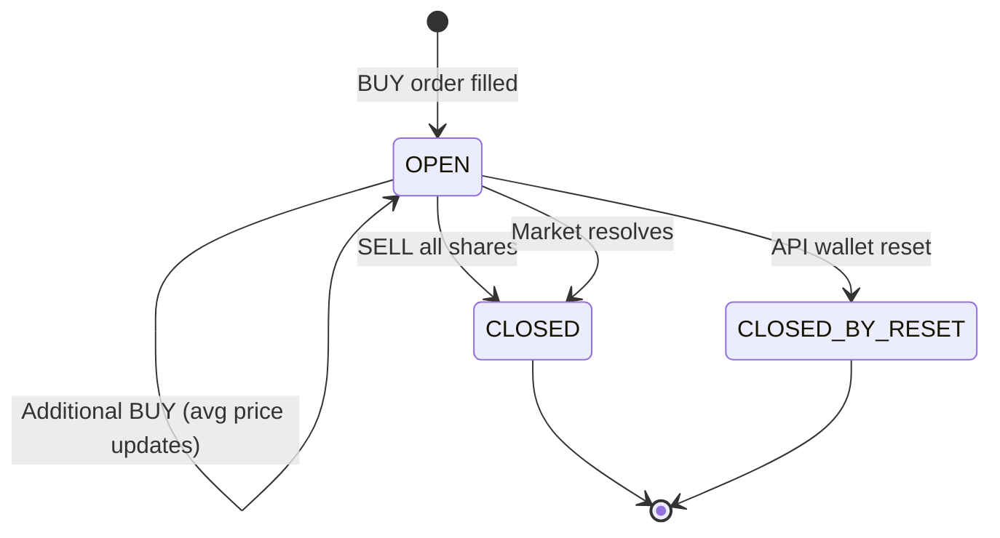

# Positions

Source: /account/positions

# Positions

```
GET /v1/account/positions
```

Returns your current positions with live market values and unrealized P&L.

---

## Authentication

API key only — `X-API-Key: ` (or the PM-compat `POLY_API_KEY` /
`Authorization: Bearer ps_live_...` aliases). A Supabase Bearer JWT is **not**
accepted here.

---

## Query Parameters

| Parameter | Type | Default | Description |
|-----------|------|---------|-------------|
| `status` | string | — | Filter: `OPEN` or `CLOSED`. **Omit to return all positions.** `OPEN` returns positions with `quantity > 0`; `CLOSED` includes reset-archived (`CLOSED_BY_RESET`) positions. Any other value is ignored (treated as no filter). |
| `wallet_id` | int \| `"all"` \| `"api"` | `api` | Wallet scope. An integer scopes to a single wallet you own (404 `WALLET_NOT_FOUND` otherwise). `api` scopes to your API wallet (including legacy rows recorded before per-wallet attribution). `all` returns every position across **all** your wallets, UI MAIN/SANDBOX included. Keywords are case-insensitive; any other value returns 422 `VALIDATION_FAILED`. **Omitted = `api`.** |
| `envelope` | bool | `false` | When `true`, wrap the response in the Polymarket-shape `{ "limit": N, "count": N, "next_cursor": "", "data": [...] }` envelope. `next_cursor` is always `""` because positions are unpaginated. Default `false` returns the bare array. |

  **Default changed on 2026-06-10.** Before 2026-06-10 the default (param
  omitted) returned positions across **all** wallets — UI MAIN/SANDBOX
  included — which could not reconcile with [Balance](/account/balance) /
  [Portfolio](/account/portfolio) (both API-wallet scoped). The default is
  now the **API wallet**, consistent with those endpoints. Pass
  `wallet_id=all` if you depended on the old cross-wallet behaviour.

  This endpoint is **unpaginated** — there is no `limit`/`offset`. It returns
  every matching position in one response. For paginated results use
  [Trade History](/account/trade-history). Polymarket's `status=ALL` has no
  direct equivalent — simply omit `status` to get the unfiltered set.

---

## Request

```bash
curl -H "X-API-Key: $API_KEY" \
  "https://api.polysimulator.com/v1/account/positions?status=OPEN"

# Polymarket-shape envelope
curl -H "X-API-Key: $API_KEY" \
  "https://api.polysimulator.com/v1/account/positions?status=OPEN&envelope=true"
```

---

## Response

```json
[
  {
    "id": 1,
    "market_id": "0x1a2b3c...",
    "outcome": "Yes",
    "quantity": "10.0",
    "avg_entry_price": "0.65",
    "current_price": "0.70",
    "market_value": "7.00",
    "unrealized_pnl": "0.50",
    "status": "OPEN",
    "market_question": "Will it rain tomorrow?"
  }
]
```

| Field | Type | Description |
|-------|------|-------------|
| `id` | int | Position ID |
| `market_id` | string | Market `condition_id` |
| `outcome` | string | Outcome name (e.g. `Yes` / `No`) |
| `quantity` | string | Number of shares held |
| `avg_entry_price` | string | Volume-weighted average entry price |
| `current_price` | string \| null | Latest market price for this outcome. `null` when no live price is cached. |
| `market_value` | string \| null | `quantity × current_price`. `null` when `current_price` is `null`. |
| `unrealized_pnl` | string \| null | `market_value − (quantity × avg_entry_price)`. `null` when `current_price` is `null`. |
| `status` | string | `OPEN`, `CLOSED`, or `CLOSED_BY_RESET` |
| `market_question` | string \| null | Market question text; `null` when the market is not in the local cache |

  When no live price is cached for a position, `current_price`,
  `market_value`, and `unrealized_pnl` are returned as `null`. (Aggregate
  endpoints like [Balance](/account/balance) and [Portfolio](/account/portfolio)
  fall back to entry-price valuation internally, but this per-position endpoint
  surfaces the missing price as `null`.)

With `envelope=true` the same rows are wrapped Polymarket-style:

```json
{
  "limit": 1,
  "count": 1,
  "next_cursor": "",
  "data": [ { "id": 1, "market_id": "0x1a2b3c...", "outcome": "Yes", "quantity": "10.0", "avg_entry_price": "0.65", "current_price": "0.70", "market_value": "7.00", "unrealized_pnl": "0.50", "status": "OPEN", "market_question": "Will it rain tomorrow?" } ]
}
```

---

## Python Example

```python
import requests, os
from decimal import Decimal

BASE_URL = os.environ["POLYSIM_BASE_URL"]
headers = {"X-API-Key": os.environ["POLYSIM_API_KEY"]}

# Fetch open positions (this endpoint is unpaginated — no limit/offset)
resp = requests.get(
    f"{BASE_URL}/v1/account/positions",
    headers=headers,
    params={"status": "OPEN"},
)
resp.raise_for_status()
positions = resp.json()

total_unrealized = Decimal("0")
for pos in positions:
    # current_price / market_value / unrealized_pnl are null when no live
    # price is cached — guard before summing.
    unrealized = Decimal(pos["unrealized_pnl"]) if pos["unrealized_pnl"] is not None else Decimal("0")
    total_unrealized += unrealized
    print(f"{pos['market_id'][:16]} {pos['outcome']}: "
          f"qty={pos['quantity']} entry={pos['avg_entry_price']} "
          f"now={pos['current_price']} pnl={pos['unrealized_pnl']}")

print(f"\nTotal unrealized P&L: ${total_unrealized}")
```

---

## Position Lifecycle



A position closed by `POST /v1/account/reset-api-balance` carries the
`CLOSED_BY_RESET` status. The `status=CLOSED` filter surfaces both `CLOSED`
and `CLOSED_BY_RESET` positions.

---

## Errors

All errors return `{"error": "<CODE>", "message": ""}`.

| Status | `error` code | When |
|--------|--------------|------|
| 401 | `MISSING_API_KEY` | No API key header supplied |
| 401 | `INVALID_KEY` | API key is unknown, deactivated, or expired |
| 404 | `WALLET_NOT_FOUND` | Integer `wallet_id` does not exist or is not owned by the caller |
| 422 | `VALIDATION_FAILED` | `wallet_id` is neither an integer, `all`, nor `api` |

---

## Next Steps

- [Portfolio](/account/portfolio) — Aggregate view with balance + positions
- [Equity Curve](/account/equity-curve) — Track value over time
