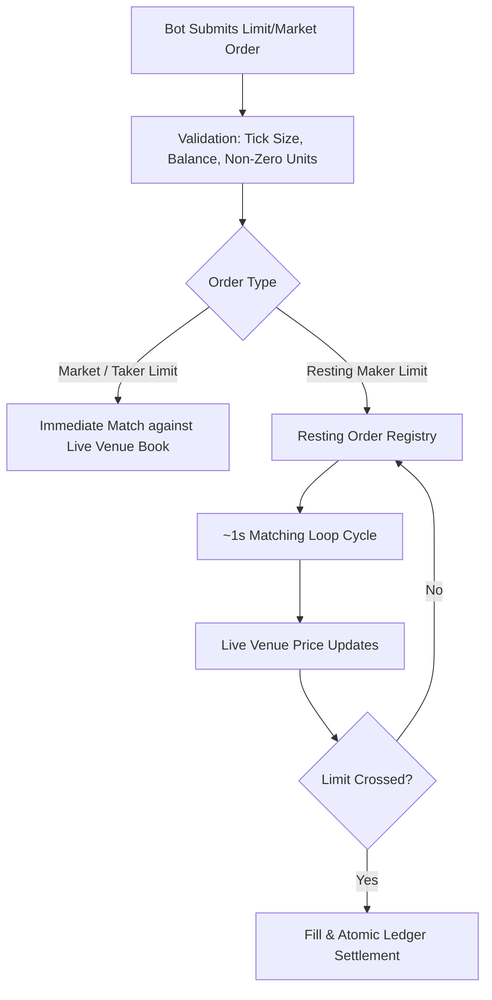

# Simulation Realism & Honest Limits

Source: /concepts/honest-limits

# Simulation Realism & Honest Limits

PolySimulator is designed to provide **venue-compatible paper trading for bot development**: develop and validate a Polymarket trading bot against a compatible API (CLOB-compatible routes + drop-in SDK integration), with real-time prices and real accounting, without risking capital — then switch endpoints to go live.

This page documents exactly what PolySimulator **does** and **does not** simulate. Transparent execution boundaries build reliable trading systems.

---

## The Execution Model

### 1. ~1-Second Matching Loop

* **Resting limit orders** are evaluated by a background matching loop running approximately every **1 second**.
* When the live venue price crosses your limit price, your resting order is filled on the next loop cycle.
* **Latency implication:** High-frequency, sub-second latency arbitrage strategies will observe optimistic fills compared to live venue execution, because paper resting orders do not contend with exchange gateway transit latency or colocation queues.

### 2. Live-Price Fill Source

* Every fill executes against **live Polymarket venue prices** sampled in real time from the Polymarket CLOB WebSocket and REST feeds.
* Fills evaluate prices through a priority cascade:
  1. **Order Book Walk (VWAP):** Size-aware execution walking the merged primary and complementary order books.
  2. **Top of Book (Best Bid/Ask):** Best available touch price with complement-aware merging.
  3. **CLOB Midpoint Cache:** Sub-millisecond cached midpoint `(best_bid + best_ask) / 2`.
  4. **Cached Display Price:** Sanity-checked outcome price.

---

## What Is and Is Not Simulated

| Dimension | Paper Trading (PolySimulator) | Live Polymarket Venue | Notes |
| :--- | :--- | :--- | :--- |
| **API Wire Compatibility** | ✅ Identical | Native Polymarket | 1:1 CLOB-compat routes, order shapes, and data endpoints. |
| **Price Feeds** | ✅ Live Real-Time | Live Real-Time | Real CLOB book depth, Binance spot, and Chainlink oracle feeds. |
| **Fee Schedule** | ✅ Exact V2 Schedule | Exact V2 Schedule | Per-category taker fees (crypto 7%, economics/culture/weather/other 5%, finance/politics/mentions/tech 4%, sports 3%, geopolitics 0%, unknown/missing category **5% fallback**). See [Trading Fees](/trading/fees). |
| **Balance & Portfolio Accounting** | ✅ Exact & Atomic | On-Chain / Vault | String-decimal arithmetic, wallet isolation, PnL tracking. |
| **Tick Size & Precision** | ✅ Strict Grid Enforcement | Strict Grid Enforcement | 0.1, 0.01, 0.001, 0.0001 tick sizes strictly validated. |
| **Queue Position (FIFO)** | ❌ Not Simulated | Live FIFO Queue | Fills trigger on price crossing regardless of volume ahead in queue. |
| **Self / Market Impact** | ❌ No Impact | Market Impact | Large paper orders do not move the real-world venue order book. |
| **On-Chain Settlement** | ❌ Simulated Ledger | Polygon PoS | Paper trading requires no gas, private keys, or wallet transactions. |

### Numeric exceptions (honest, not hidden)

| Claim | Exact number | Exception |
| --- | --- | --- |
| Matching loop | ~**1 second** | Loop cadence is best-effort. A busy replica can skip a cycle; do not treat 1.000 s as a hard SLA. |
| Free REST | **2 req/s**, **120 req/min** | Burst can use the 2 req/s bucket first; sustained load hits the 120/min bucket. Authoritative: `GET /v1/keys/tiers`. |
| Pro REST | **10 req/s**, **600 req/min** | Same two-bucket model. |
| Pro+ REST | **30 req/s**, **1,800 req/min** | Same two-bucket model. |
| Enterprise REST | **100 req/s**, **6,000 req/min** | Same two-bucket model. |
| Order writes, one account | **~3–4 per second** | Applies on **every** tier, `enterprise` included — about 25× below the 100 req/s an enterprise key is sold at. Order writes are serialised per account by a lock held **200–294 ms (p95)**. Throughput scales by adding accounts, not tier. See [Rate Limits](/concepts/rate-limits#order-writes-are-serialised-per-account). |
| Overlapping writes, one account | `409 LOCK_BUSY_RETRY` / `503 DB_CONTENTION_RETRY` | The API returns a bounded error rather than queueing you. Both carry `Retry-After` (1 s on placement, 5 s on cancellation). Placement 503s state the order was **not** placed. |
| Public market data, cold key lookup | **2 req/s**, **120 req/min** — **per source IP** | Charged before your tier is known, so every key behind one NAT egress IP shares it. Cache TTL is 120 s and keys minted together expire together, so the 429s arrive in bursts. |
| Fee formula | 5 decimal places | Amount **debited** is settled at **cent** precision (`Numeric(18,2)`). Sub-cent fees round to `$0.00`. |
| Unknown category fee | **5% / 500 bps** | Applied when the market has no category. Not geopolitics (0%). |
| API wallet | Pro **$10,000**, Pro+ **$25,000** | Free keys have **no** API wallet and cannot trade. MAIN ($1,000) is never used by API keys. |
| Tick sizes | `0.1` / `0.01` / `0.001` / `0.0001` | Market-aware. Off-grid limits return `INVALID_ORDER_MIN_TICK_SIZE`. |
| String numerics | JSON **strings** for prices, sizes, balances | Polymarket-parity exceptions: `GET /v1/tick-size/{token_id}` `minimum_tick_size` and `GET /v1/markets/updown` `live_price.buy/sell` are JSON **numbers**. See [String Numerics](/concepts/string-numerics). |

---

## Simulation Boundaries in Detail

### No Queue-Position Modelling
In a live matching engine, when you place a limit order at the current bid, your order joins the back of the queue at that price level and only fills after all orders placed before yours have been matched or canceled. 

In PolySimulator paper trading, resting orders match whenever the venue price crosses your limit. If you place a limit BUY at $0.50 and the venue trades at $0.50, your order fills on the next loop iteration without simulating queue depletion ahead of you. 

  For realistic backtesting that models queue dynamics and historical book reconstruction, use the upcoming **Simulation SKU** rather than paper trading.

### Order Writes Are Serialised Per Account

Every order write on one account — place, batch place, and cancel — is serialised behind a per-account advisory lock and the account's `accounts` row lock. Measured on 2026-09-02, that lock is held for **200–294 ms at p95**, flat from 1 to 16 concurrent traders, because it is the intrinsic cost of one write rather than congestion. One account therefore sustains roughly **3–4 order writes per second**, and no tier changes that: an `enterprise` key is sold at 100 req/s and reaches about 4/s on the write path.

The consequence is worth stating plainly rather than letting you discover it as errors. **Aggregate write throughput scales with the number of accounts, not with the size of the plan.** Sixteen independent accounts sustained 51.8 req/s of order traffic with zero errors in the same measurement. A prop firm running N funded traders on N accounts gets roughly N × 3–4 writes/s; the same firm fanning N threads at one account gets 3–4 and a stream of contention errors.

When you do overlap writes on a single account, the API returns a bounded error rather than queueing you: `409 LOCK_BUSY_RETRY` once the 2 s cooperative wait elapses, or `503 DB_CONTENTION_RETRY` once the 200 ms database lock timeout fires. Both carry `Retry-After` in seconds, and with an `Idempotency-Key` the retry is safe. See [Rate Limits](/concepts/rate-limits#order-writes-are-serialised-per-account) for the full contract.

### No Self-Impact
In live markets, large orders consume liquidity and shift the market price against the trader. In PolySimulator, your trades update your virtual portfolio and ledger, but do not affect external Polymarket order books. Size-aware VWAP book walking simulates the price you *would* receive given current book depth, but does not move the market for subsequent orders.

---

## What PolySimulator Guarantees

  
    Price, quantity, and balance values are transmitted as JSON strings (e.g. `"0.52"`) except the documented Polymarket-parity exceptions in [String Numerics](/concepts/string-numerics) (`GET /v1/tick-size/{token_id}` `minimum_tick_size` and `/v1/markets/updown` `live_price.buy/sell`). The backend still enforces exact decimal math without binary float rounding errors.
  

  
    API keys trade exclusively against an isolated **API Sandbox Wallet** ($10,000 baseline for Pro, $25,000 for Pro+). The primary UI wallet (`MAIN`) is never modified by API trading.
  

  
    Duplicate submissions carrying the same `client_order_id` (or `Idempotency-Key` header) return the existing order without double-executing.
  

  
    Order validation rejects off-grid ticks (`INVALID_ORDER_MIN_TICK_SIZE`), below-minimum sizes (`INVALID_ORDER_MIN_SIZE`), and insufficient balance with identical Polymarket-style error envelopes.
  

---

## Operational Boundaries & Beta SLA

* **Beta Availability:** PolySimulator API Beta is a development and validation environment. While we aim for high uptime (>99.9%), the beta surface does not carry a formal financial SLA.
* **Rate Limits:** Per-key rate limits are enforced via Redis **fixed-window** counters — one per-second bucket and one per-minute bucket (e.g. Free: 2 RPS / 120 RPM, Pro: 10 RPS / 600 RPM). A fixed window is not a sliding window: a client that aligns to the bucket boundary can briefly send up to **twice** its per-second allowance (two requests just before a second ticks over and two just after are four requests in milliseconds, and all four are admitted). We size tiers with that in mind and we would rather tell you than have you discover it. See [Rate Limits](/concepts/rate-limits) for the exact behaviour.
* **Per-Account Write Ceiling:** Tier limits bound requests; they do not bound order writes on one account. One account sustains **~3–4 order writes per second on every tier** because each write holds a per-account lock for 200–294 ms. Size a deployment by accounts — one per strategy, participant, or funded trader — not by tier. Overlapping writes on one account return `409 LOCK_BUSY_RETRY` or `503 DB_CONTENTION_RETRY` with `Retry-After`, never an unbounded queue. See [Order writes are serialised per account](/concepts/rate-limits#order-writes-are-serialised-per-account).
* **Rate Limiter Availability:** The limiter stores its counters in Redis, and it **fails open** — if Redis is unreachable, requests are admitted rather than rejected, so a cache outage degrades enforcement instead of taking the API down. That is a deliberate availability trade: we would rather serve you unlimited for a few minutes than 500 every request. A bounded fallback budget can be enabled per environment, and every such event is counted (`polysim_api_rate_limit_redis_error_total`) so a silently-disabled limiter is visible to us.
* **Deprecation Policy:** Breaking API or schema changes during public beta will be communicated with at least **14 days notice** via email and documentation changelogs.
