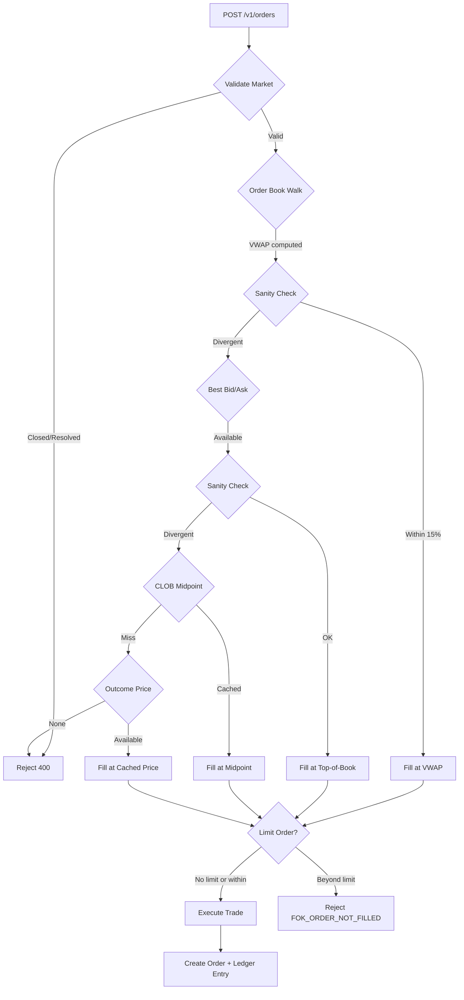

# Trade Execution Internals

PolySimulator aims to replicate Polymarket's execution semantics as closely as possible while providing instant fills for paper trading. This document describes exactly how fill prices are determined.

## Execution Priority Cascade

When you submit a trade, the execution engine evaluates price sources in this order:

```
1. Redis Order Book Walk (VWAP)
   ↓ if unavailable or sanity check fails
2. Best Bid/Ask from Order Book
   ↓ if unavailable or sanity check fails
3. CLOB Midpoint Cache
   ↓ if unavailable
4. Cached Outcome Price (Gamma API / SSE)
```

Each layer has sanity guards that reject fills diverging more than **15%** from the expected price. If all layers fail, the trade is rejected with `Price unavailable for market`.

---

## Layer 1: Order Book Walk (VWAP)

For size-aware execution, the engine walks the order book to compute a Volume-Weighted Average Price (VWAP).

### How It Works

| Side | Book Side Walked | Direction |
|------|------------------|-----------|
| BUY  | Asks (offers)    | Ascending (best first) |
| SELL | Bids            | Descending (best first) |

The engine accumulates fills level-by-level until the requested quantity is satisfied:

```python
remaining = quantity
total_cost = 0.0

for (price, size) in sorted_levels:
    fill_at_level = min(remaining, size)
    total_cost += fill_at_level * price
    remaining -= fill_at_level
    if remaining <= 0:
        break

vwap = total_cost / quantity
```

### Complement-Aware Execution

PolySimulator replicates Polymarket's dual-book matching. In binary markets, you can fill a BUY by:

1. **Buying the primary token** from its ask side, OR
2. **Selling the complementary token** from its bid side

The effective price conversion:
- `effective_ask = 1 - complementary_bid`
- `effective_bid = 1 - complementary_ask`

Both books are merged and sorted before walking. This prevents thin primary books from producing absurd fills when the complement has better liquidity.

### Sanity Guards

The book walk is rejected if the VWAP diverges materially from the cached display price:

| Side | Rejection Condition |
|------|---------------------|
| BUY  | `vwap > cached_price × 1.15` OR `vwap < cached_price - 0.15` |
| SELL | `vwap < cached_price × 0.85` OR `vwap > cached_price + 0.15` |

---

## Layer 2: Best Bid/Ask

If the order book walk is unavailable, the engine uses the top-of-book prices:

| Side | Price Used |
|------|------------|
| BUY  | Best Ask (lowest offer) |
| SELL | Best Bid (highest bid) |

### Complement Merging

The best bid/ask is computed from both the primary and complementary order books:

```python
# Effective best ask = min(primary_ask, 1 - complementary_bid)
# Effective best bid = max(primary_bid, 1 - complementary_ask)
```

### Sanity Guards

If the selected fill price diverges more than **15%** from the cached outcome price:

1. First, try the primary-only best bid/ask (ignoring complement)
2. If that also diverges, **reject the fill** and fall through to the next layer

This prevents the complement-book logic from accidentally inverting fills on high-probability outcomes.

---

## Layer 3: CLOB Midpoint Cache

Redis stores the latest CLOB midpoint for each token:

```
cache key (internal) → float (e.g., 0.8523)
```

The midpoint is `(best_bid + best_ask) / 2` from Polymarket's live order book, refreshed every 30 seconds by the price poller.

**Latency**: Sub-millisecond (Redis GET).

---

## Layer 4: Cached Outcome Price

The final fallback uses the cached display price from the Gamma API or SSE price feed. This is the price visible in the UI.

### Label Matching

The engine matches the requested outcome label (`"Yes"`, `"Up"`, `"Down"`, etc.) against the market's outcome array:

```python
for outcome in market.outcomes:
    if outcome.label.lower() == requested_outcome.lower():
        return outcome.price
```

This ensures label → price mapping is correct even when the Gamma API's `buy`/`sell` fields don't correspond positionally to `outcomes[0]`/`outcomes[1]`.

### Fallback Chain

If direct label matching fails:

1. Try conventional aliases (`yes`/`no` → first/second outcome)
2. Compute midpoint from `best_bid` + `best_ask` fields
3. Use `last_trade` price if spread is wide (>10%)
4. Average `yes_price` + `no_price`

---

## Limit Order Enforcement

For limit orders, the fill price is validated against your specified limit:

| Side | Condition for Fill |
|------|---------------------|
| BUY  | `fill_price ≤ limit_price` |
| SELL | `fill_price ≥ limit_price` |

<Warning>
**FOK Semantics**: If the market price has moved past your limit, the order is rejected outright with `FOK_ORDER_NOT_FILLED_ERROR`. Unlike some brokers, PolySimulator does NOT cap your fill at the limit price. This matches Polymarket's IOC/FOK behavior.
</Warning>

---

## Price Source Tracking

Every fill records which price source was used:

| Source | Meaning |
|--------|---------|
| `book_walk` | VWAP from order book walk |
| `best_ask` | Top-of-book ask (BUY) |
| `best_bid` | Top-of-book bid (SELL) |
| `clob_midpoint_cached` | Redis CLOB midpoint |
| `outcome_X` | Cached price for outcome X |
| `midpoint` | bid/ask midpoint fallback |
| `last_trade_spread_fallback` | Last trade (wide spread) |

This is returned in the order response and stored in the `orders` table for audit.

---

## Spread & Impact Metrics

Each fill computes:

| Metric | Formula |
|--------|---------|
| `spread_bps` | `(best_ask - best_bid) / midpoint × 10,000` |
| `impact_bps` | How much worse your fill was vs best price |

These are available in the order response and help you understand execution quality.

---

## Market Validation

Before execution, the engine validates:

1. **Not closed**: `closed=false`
2. **Active**: `active=true`
3. **Not resolved**: `resolved_outcome` is null
4. **Not expired**: `end_date` is in the future (or SELL for emergency exit)
5. **Price sanity**: Outcome prices don't sum > 1.5 (post-expiry detection)

<Note>
**Emergency Exits**: When selling a position on an expired market with no live price, the engine allows a break-even exit at your entry price rather than blocking the trade.
</Note>

---

## Idempotency

Every trade requires a `client_order_id` (or `Idempotency-Key` header). Duplicate submissions return the original order without re-executing.

This is critical for:
- Retry-safe bot execution
- Preventing accidental double-fills on network timeouts
- Audit trail integrity

---

## Example Execution Flow



---

## Source Code Reference

The execution logic lives in [`internal source`](https://github.com/Bavariance/polysimulator/blob/main/internal source):

- `internal function` — VWAP calculation with complement merging
- `internal function` — Top-of-book with sanity guards
- `internal function` — Redis midpoint lookup
- `internal function` — Cached price fallback chain
- `internal function` — Label → price resolution

For the full audit trail, see the `orders` table schema in the database.
